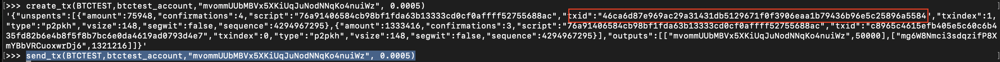
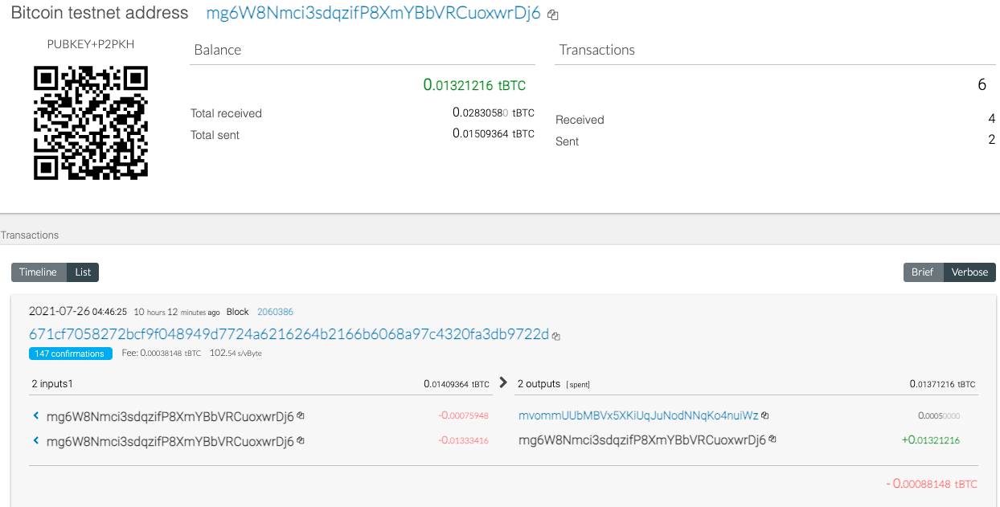
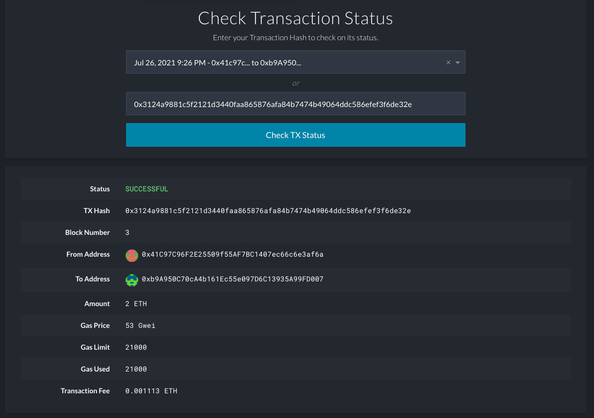

# Crypto-Wallet


## Multi-Blockchain Wallet in Python

we are going to set-up a command line tool called hd-wallet-derive that supports not only BIP32, BIP39, and BIP44, but
also supports non-standard derivation paths for the most popular wallets out there today. This wallet works in hand- with the integrated wallet python script.

There are only 2 coins set-up in this example: Ethereum and Bitcoin Testnet.
Ethereum keys are the same format on any network, so the Ethereum keys should work with your custom networks or testnets.

## Executing Transactions by Calling Functions in wallet.py

1. Open terminal window inside of the wallet folder and execute the following command.
```
python
```
2. Within the Python shell, run the command below to allow you to access the functions in wallet.py interactively.
```
from wallet import *
```
The follwing json output appears.


3. For the Bitcoin Testnet transaction run the following command to send a test transaction for 0.0005 BTC

```
create_trx(BTCTEST,btctest_account,"mvommUUbMBVx5XKiUqJuNodNNqKo4nuiWz", 0.0005)

send_tx(BTCTEST,btctest_account,"mvommUUbMBVx5XKiUqJuNodNNqKo4nuiWz", 0.0005)
```

we can check our transaction on [block explorer](https://tbtc.bitaps.com/) by entering our transaction ID.





4. For ETH, run the following command to send our test transaction

```
create_tx(ETH,eth_account, "0xb9A950C70cA4b161Ec55e097D6C13935A99FD007", 2)
send_tx(ETH,eth_account, "0xb9A950C70cA4b161Ec55e097D6C13935A99FD007", 2)
```
